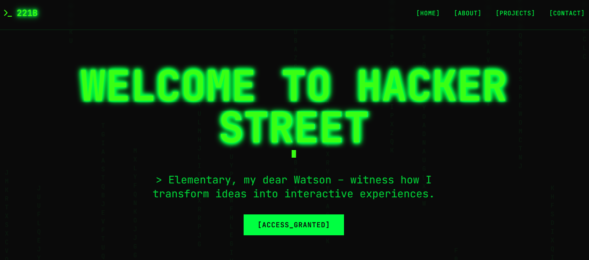

```
██████╗ ██████╗  ██╗██████╗ 
╚════██╗╚════██╗███║██╔══██╗
 █████╔╝ █████╔╝╚██║██████╔╝
██╔═══╝ ██╔═══╝  ██║██╔══██╗
███████╗███████╗ ██║██████╔╝
╚══════╝╚══════╝ ╚═╝╚═════╝ 
```

> *"Elementary, my dear Watson – witness how I transform ideas into interactive experiences."*

## 📸 Home of the Hacker Street

[](public/hacker-street.PNG)

A cyberpunk-themed portfolio website with interactive terminal, matrix rain effects, and Sherlock Holmes aesthetic.

## ✨ Features

- 🖥️ **Interactive Terminal** - Fully functional terminal with custom commands
- 🌧️ **Matrix Rain Effect** - Cascading green characters background
- 🎨 **Cyberpunk UI** - Dark themes with neon green accents and glitch effects
- 📱 **Responsive Design** - Optimized for all devices
- 🚨 **Custom 404 Page** - "NOT SO FAST!" themed error handling
- 🔐 **Access Control System** - Sherlock Holmes themed animations.
- ⚡ **Lightning Fast** - Built with Vite for optimal performance

## 🚀 Quick Start

```bash
git clone https://github.com/githubber-me/221B.git
cd 221B
npm install

# Set up environment variables
cp env.example .env.local
# Edit .env.local with your Supabase credentials

npm run dev
```

## 🛠️ Tech Stack

**Frontend**
- React 18 + TypeScript
- Vite (Build Tool)
- Tailwind CSS + Custom Cyber Theme

**UI & Components**
- Radix UI (Accessible Components)
- Lucide React (Icons)
- React Hook Form + Zod

**Backend & Database**
- Supabase (Authentication & Database)
- TanStack Query (Data Fetching)

## 📁 Project Structure

```
221B/
├── src/
│   ├── components/
│   │   ├── InteractiveTerminal.tsx    # Main terminal component
│   │   ├── landing/                   # Landing page components
│   │   └── ui/                        # Reusable UI components
│   ├── pages/                         # Route components
│   │   ├── Index.tsx                  # Home page
│   │   ├── About.tsx                  # About page
│   │   ├── Projects.tsx               # Projects showcase
│   │   ├── Contact.tsx                # Contact form
│   │   └── NotFound.tsx               # 404 page
│   └── lib/                           # Utilities & configurations
└── public/                            # Static assets
```

## 🎨 Customization

### 🏠 Personalizing Your Portfolio

**1. Update Site Content**
- `src/components/landing/Hero.tsx` - Change main heading and tagline
- `src/pages/About.tsx` - Add your personal story and background
- `src/pages/Projects.tsx` - Showcase your own projects
- `src/pages/Contact.tsx` - Update contact information

### Adding New Terminal Commands
Edit `src/components/InteractiveTerminal.tsx`:

```typescript
case 'yourcommand':
  output = 'Your command output here';
  break;
```

### Color Scheme
- `cyber-black`: Primary background
- `cyber-dark`: Secondary background  
- `terminal-green`: Primary text/accent
- `terminal-bright-green`: Highlighted text

## 🔧 Environment Setup

Create `.env.local`:
```env
VITE_SUPABASE_URL=your_supabase_url
VITE_SUPABASE_ANON_KEY=your_supabase_anon_key
```

## 🚀 Deployment

```bash
npm run build
# Deploy to Vercel, Netlify, or any static hosting
```

---

## 👨‍💻 Developed By

**221B** was created and is maintained by [Anthahkarana](https://linkedin.com/in/anthahkarana).

- **Portfolio**: [anthahkarana.tech](https://anthahkarana.tech)
- **GitHub**: [@githubber-me](https://github.com/githubber-me)

## 🙏 Support

- ⭐ **Star this repo** if it helped you!
- 🐛 **Report issues** on GitHub
- 💡 **Suggest improvements** via discussions
- 🔄 **Share with other developers**

---
